# Database schema

Entity-relationship diagram for the FirstClub Membership backend. The schema is owned by
**Flyway** (`src/main/resources/db/migration`); Hibernate runs `ddl-auto=validate`. This document is
generated from those migrations — regenerate it when a new `V__*.sql` migration lands.

The diagram below renders automatically on GitHub. See [ARCHITECTURE.md](../ARCHITECTURE.md) for the
design rationale behind the concurrency guards and configurable (rows-not-enums) tables.

```mermaid
erDiagram
    membership_plan ||--o{ subscription : "billed by"
    membership_tier ||--o{ subscription : "grants"
    membership_tier ||--|| tier_criteria : "qualifies via"
    membership_tier ||--o{ tier_benefit : "unlocks"
    benefit         ||--o{ tier_benefit : "mapped by"
    subscription    ||--o{ subscription_event : "audited by"
    subscription    ||--o{ credit_note : "refunded by"
    subscription    ||--o{ payment : "paid by"
    app_user        ||--o{ subscription : "subscribes"
    app_user        ||--o{ subscription_event : "acts in"
    app_user        ||--o{ credit_note : "credited"
    app_user        ||--o{ payment : "pays"
    app_user        ||--o| user_order_stats : "has"
    app_user        ||--o{ user_order_event : "places"
    app_user        ||--o{ user_monthly_spend : "accrues"

    app_user {
        bigint      id PK "identity, start 8000"
        varchar     name
        varchar     email UK
        varchar     cohort "nullable"
        timestamptz created_at
    }

    membership_plan {
        bigserial     id PK
        varchar       cadence UK "MONTHLY / QUARTERLY / ..."
        varchar       name
        numeric       price
        integer       duration_days
        integer       trial_days "0 = no trial; YEARLY seeded 7"
        boolean       active
        timestamptz   created_at
        timestamptz   updated_at
    }

    membership_tier {
        bigserial   id PK
        varchar     code UK
        varchar     name
        integer     rank UK "rank-ordered"
        numeric     price_multiplier "premium over base: GOLD 1.5x, PLATINUM 2x"
        boolean     active
        timestamptz created_at
        timestamptz updated_at
    }

    tier_criteria {
        bigserial   id PK
        bigint      tier_id FK,UK
        integer     min_orders "nullable = rule N/A"
        numeric     min_monthly_spend "nullable = rule N/A"
        jsonb       cohorts "default []"
        timestamptz created_at
        timestamptz updated_at
    }

    benefit {
        bigserial   id PK
        varchar     code UK
        varchar     type "FREE_DELIVERY / EXTRA_DISCOUNT / EXCLUSIVE_DEALS / EXCLUSIVE_COUPONS / PRIORITY_SUPPORT"
        varchar     name
        varchar     description "nullable"
        boolean     active
        timestamptz created_at
        timestamptz updated_at
    }

    tier_benefit {
        bigserial   id PK
        bigint      tier_id FK
        bigint      benefit_id FK
        jsonb       params "per-tier tuning, e.g. {discountPct:10} / {couponsPerCycle:2}"
        boolean     active
        timestamptz created_at
        timestamptz updated_at
    }

    subscription {
        bigserial   id PK
        bigint      user_id FK "indexed"
        bigint      plan_id FK
        bigint      tier_id FK
        varchar     status "PENDING / ACTIVE / EXPIRED / CANCELLED"
        timestamptz start_at
        timestamptz expires_at "partial idx where ACTIVE"
        boolean     auto_renew
        numeric     price_paid "locked at purchase (grandfathering)"
        timestamptz trial_end "nullable; cleared on convert to paid"
        integer     renewal_attempts "consecutive failed renewals (dunning)"
        timestamptz next_retry_at "nullable; next dunning retry"
        bigint      version "optimistic lock"
        timestamptz created_at
        timestamptz updated_at
    }

    credit_note {
        bigserial   id PK
        bigint      subscription_id FK
        bigint      user_id FK "indexed with created_at"
        numeric     amount
        varchar     reason
        timestamptz created_at
    }

    payment {
        bigserial   id PK
        bigint      subscription_id FK
        bigint      user_id FK
        varchar     reference UK "doubles as gateway idempotency key"
        numeric     amount
        varchar     currency "3-char code, default INR"
        varchar     status "INTENDED / CHARGED / APPLIED / ABANDONED / REFUNDED"
        varchar     gateway_txn_id "nullable until charged"
        varchar     purpose "SUBSCRIBE / UPGRADE / RENEWAL / TRIAL_CONVERSION"
        varchar     failure_reason "nullable"
        bigint      version "optimistic lock"
        timestamptz created_at "partial idx where CHARGED = money moved, not applied"
        timestamptz updated_at
    }

    subscription_event {
        bigserial   id PK
        bigint      subscription_id FK
        bigint      user_id FK "indexed with created_at"
        varchar     type
        jsonb       detail "default {}"
        timestamptz created_at
    }

    user_order_stats {
        bigint        user_id PK,FK
        integer       order_count "lifetime"
        jsonb         cohorts "default []"
        timestamptz   updated_at
    }

    user_order_event {
        bigint        order_id PK "idempotency key; re-delivery is a no-op"
        bigint        user_id FK
        numeric       amount "one order's value; refund re-asserts lower"
        timestamptz   occurred_at "decides the spend month, not receipt time"
        timestamptz   received_at
    }

    user_monthly_spend {
        bigint        user_id PK,FK
        varchar       year_month PK "'YYYY-MM', UTC"
        numeric       amount "derived: SUM over user_order_event for the month"
        timestamptz   updated_at
    }

    idempotency_key {
        bigserial   id PK
        varchar     idem_key "UK with endpoint"
        varchar     endpoint
        integer     status_code
        text        response_body
        timestamptz created_at
    }

    job_cursor {
        varchar     job_name PK "one row per sweep job"
        bigint      last_id "highest id processed; 0 = from the start"
        bigint      version "optimistic lock"
        timestamptz updated_at
    }
```

## Identity and `user_id`

This is a single monolith that owns identity, so every `user_id` is a **foreign key** to `app_user`:
`subscription`, `subscription_event`, `credit_note`, `payment`, `user_order_stats`, `user_order_event`,
and `user_monthly_spend`. The model is **registration-first** — a user is provisioned in `app_user`
before it can subscribe or accrue activity: the subscribe and activity write paths reject an
unregistered `user_id` with a `404`, and the foreign keys enforce the same invariant at the DB layer
(V22).

## Constraints & indexes worth knowing

| Object | Kind | Purpose |
| --- | --- | --- |
| `uq_active_subscription_per_user` | partial unique index on `subscription(user_id) where status in ('PENDING','ACTIVE')` | At most **one live subscription per user**. Covers `PENDING` so the invariant holds *before* money moves in the reserve→charge→activate flow (V11). |
| `subscription.version` | `@Version` optimistic lock | Prevents lost updates on concurrent subscription mutation. |
| `idx_subscription_expires_at` | partial index `where status='ACTIVE'` | Powers the batched expiry sweep without a full-table scan. |
| `uq_idem_key_endpoint` | unique `(idem_key, endpoint)` | Collapses client retries on mutation endpoints. |
| `uq_criteria_tier` | unique `(tier_id)` | One criteria row per tier. |
| `uq_tier_benefit` | unique `(tier_id, benefit_id)` | One mapping per tier/benefit pair. |
| `uq_tier_code`, `uq_tier_rank` | unique on `membership_tier` | Codes and ranks are distinct; ranks are strictly ordered. |
| `idx_subscription_user` | index `subscription(user_id)` | Look up a user's subscriptions. |
| `idx_sub_event_user_created` | index `subscription_event(user_id, created_at)` | Chronological audit trail per user. |
| `idx_credit_note_user` | index `credit_note(user_id, created_at)` | Chronological credit history per user. |
| `uq_payment_reference` | unique `payment(reference)` | **One charge per attempt.** The reference doubles as the gateway idempotency key, so this makes a duplicate charge unrepresentable rather than merely unlikely (V12). |
| `idx_payment_unapplied` | partial index `where status='CHARGED'` | Makes "money moved but nothing was applied" a cheap query — the backing index for `PaymentReconciliationJob` and its alert gauge (V12). |
| `ck_payment_status` | check on the five ledger states | Keeps the payment lifecycle closed at the DB layer. |
| `idx_subscription_trial_end`, `idx_subscription_pending`, `idx_subscription_active_id` | partial indexes matching each job's predicate exactly | The scheduled sweeps were doing full scans; these match the `WHERE` clauses the jobs actually issue (V13). |
| `user_monthly_spend` PK | composite primary key `(user_id, year_month)` | One spend bucket per user per calendar month, and the only access path — every read is an equality lookup on both columns, so no secondary index is needed. The bucket is a derived cache; the read stays a point lookup (V16). |
| `user_order_event` PK | primary key `(order_id)` | The idempotency key for spend. A re-delivered order updates its row instead of adding a second, so at-least-once delivery cannot double-count (V20). |
| `idx_order_event_user_time` | index `user_order_event(user_id, occurred_at) include (amount)` | Covers both the per-month recompute and rolling-window range sums as index-only reads (V20). |
| `job_cursor.version` | `@Version` optimistic lock | Two instances advancing the same sweep cursor conflict instead of both writing over each other (V21). |

## Regenerating

The source of truth for the schema is `src/main/resources/db/migration/V*.sql` (currently **V1–V21**).
After adding a migration, update the `erDiagram` block and the constraints table to match.

[`db.mermaid`](db.mermaid) holds the same `erDiagram` body as a standalone file for tooling that renders
Mermaid directly (e.g. `mmdc -i docs/db.mermaid -o db.svg`) — GitHub renders the inline block above, not a
bare `.mermaid` file. **The two must be kept in sync**; this document is the canonical copy.
